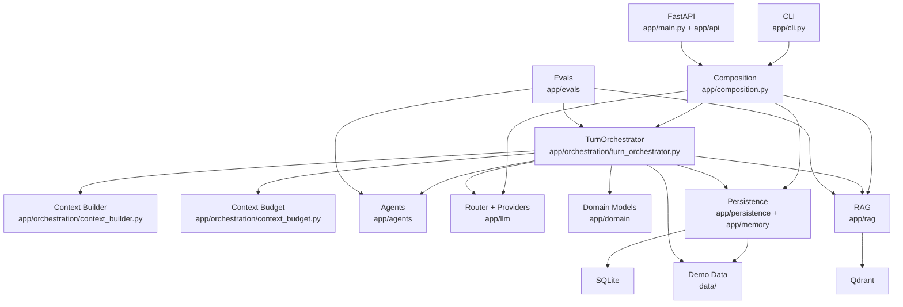

# 09 — Current Architecture Map

## Overview

`RoleRAG_POC` is a backend-first roleplaying engine with thin entry points, a single orchestrator, narrow LLM agents, SQLite persistence, and Qdrant-backed retrieval.

## Dependency Map

## Module Responsibilities

| Module | Responsibility |
|---|---|
| `app/cli.py` | local operational interface for config, sessions, routes, ingestion, and turns |
| `app/main.py` + `app/api/` | HTTP interface with thin route handlers |
| `app/composition.py` | central wiring for providers, repositories, retriever, and orchestrator |
| `app/domain/` | typed data models and visibility values |
| `app/orchestration/` | turn lifecycle, prompt assembly, and context budgeting |
| `app/agents/` | actor generation, critic evaluation, and memory extraction |
| `app/llm/` | provider abstraction, OpenAI-compatible adapter, deterministic routing |
| `app/persistence/` | JSON loading plus SQLite schema and repositories |
| `app/memory/` | recent-dialogue and durable-memory adapters |
| `app/rag/` | chunking, embedding abstraction, ingestion, retrieval, and vector-store adapters |
| `app/evals/` | deterministic regression fixtures and report runner |

## Runtime Components

### CLI

- primary local development interface
- shares the same service composition path as the API

### FastAPI API

- exposes `POST /sessions`, `POST /sessions/{session_id}/turns`, and `GET /sessions/{session_id}`
- does not duplicate orchestration logic

### TurnOrchestrator

- owns validation, retrieval triggering, route selection, repair bounds, persistence, and warnings

### ActorAgent

- sends prepared messages to a provider
- does not retrieve or persist directly

### CriticAgent

- performs structured draft validation
- may inspect hidden context for leak detection

### MemoryCurator

- performs local structured memory extraction after the final response

### MemoryIndexer

- embeds persisted memory episodes and upserts them into session-scoped retrieval
- treats SQLite as authoritative and Qdrant as a repairable derived index

### SQLite persistence

- authoritative store for sessions, turns, and memory episodes

### Qdrant vector store

- runtime index for retrievable chunks

### Retrieval ranking and diagnostics

- deterministic reranking happens in `app/rag` after vector-store search results are returned
- source weighting distinguishes `session_memory`, `persona_memory`, and `canon_lore`
- metadata-only diagnostics stay in the CLI path and are not part of player-facing API responses

### Local/cloud abstraction

- all model calls go through the same provider/request/response shape

## Data Ownership

| Data | Owner |
|---|---|
| world, scene, persona demo definitions | JSON files under `data/` |
| sessions | SQLite |
| turns | SQLite |
| durable memory episodes | SQLite |
| retrievable vectors and payloads | Qdrant |
| prompts | orchestration layer |
| generated prose | provider output until persisted as turn text |

## Safety Map

- actor prompts only receive player-visible retrieved chunks
- critic and memory extraction stay local
- route handlers stay thin
- retrieval failure does not block turn completion
- memory indexing failure does not discard persisted memories or completed turns
- tests avoid real provider and Qdrant dependencies

## Reading Order

1. [app/config.py](../app/config.py)
2. [app/composition.py](../app/composition.py)
3. [app/orchestration/turn_orchestrator.py](../app/orchestration/turn_orchestrator.py)
4. [app/orchestration/context_builder.py](../app/orchestration/context_builder.py)
5. [app/llm/router.py](../app/llm/router.py)
6. [app/rag/retriever.py](../app/rag/retriever.py)
7. [app/persistence/repositories.py](../app/persistence/repositories.py)
