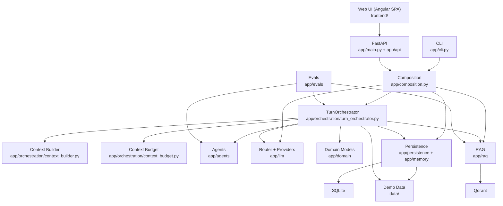

# 09 — Current Architecture Map

## Overview

`RoleRAG_POC` is a backend-owned roleplaying engine with thin entry points, an Angular SPA web UI, a single orchestrator, narrow LLM agents, SQLite persistence, and Qdrant-backed retrieval.

See [docs/README.md](README.md) for the component, turn-pipeline, and routing diagrams; this map is the module-level companion to those.

## Dependency Map

## Module Responsibilities

| Module | Responsibility |
|---|---|
| `app/cli.py` | local operational interface for config, sessions, routes, ingestion, and turns |
| `app/main.py` + `app/api/` | HTTP interface with thin route handlers |
| `frontend/` | Angular 19 SPA (play, inspector, analytics, eval) served at `/app`; see [frontend/README.md](../frontend/README.md) |
| `app/composition.py` | central wiring for providers, repositories, retriever, and orchestrator |
| `app/domain/` | typed data models and visibility values |
| `app/orchestration/` | turn lifecycle as an injectable stage pipeline (`stages/`, 13 stage modules) plus `canon_builder.py`, `draft_validator.py`, `turn_errors.py`, prompt assembly, and context budgeting |
| `app/agents/` | actor generation, critic evaluation, memory extraction, and deterministic secret-guard containment |
| `app/llm/` | provider abstraction, OpenAI-compatible adapter, deterministic routing |
| `app/persistence/` | JSON loading plus SQLite schema and repositories |
| `app/memory/` | recent-dialogue window, durable-memory store, vector indexing, semantic write-dedup, and consolidation |
| `app/rag/` | chunking, embedding abstraction, ingestion, retrieval, and vector-store adapters |
| `app/diagnostics/` | runtime environment checks, deterministic end-to-end smoke verification, eval-run serving, and the live-checkpoint/bake-off/containment-probe harnesses (10 modules) — see [docs/19_verification_and_eval_tooling.md](19_verification_and_eval_tooling.md) |
| `app/content/` | standalone scenario-pack validation and template generation |
| `app/evals/` | deterministic regression fixtures and report runner |

## Runtime Components

### CLI

- primary local development interface
- shares the same service composition path as the API
- also exposes operator-facing runtime verification through `doctor` and `smoke-run`
- also exposes authoring workflows through `validate-content` and `create-scenario-template`

### FastAPI API

- exposes runtime status, content catalog, session CRUD, mid-session scene switching, turns
  (JSON + buffered SSE), last-turn deletion (reroll), per-turn and bulk turn diagnostics,
  durable memories, session canon, and eval-run summaries — see
  [docs/12_api_contract.md](12_api_contract.md) for the full surface
- serves the built SPA as static files at `/app` (root `/` redirects there)
- does not duplicate orchestration logic
- buffers player-visible SSE text until validation and persistence complete; metadata-only
  stage-progress frames stream live during the pipeline

### Web UI (Angular SPA)

- starts new sessions through the existing API from catalog selectors
- runs turns over buffered SSE and renders safe session, transcript, route, memory, canon, and
  warning data
- adds read-only diagnostic pages: RAG inspector (per-turn retrieval drill-down), analytics
  (stage timings), and eval-run trends
- does not own orchestration, scenario-pack selection, retrieval, validation, routing,
  persistence, or memory behavior

### TurnOrchestrator

- owns validation, retrieval triggering, route selection, repair bounds, persistence, and warnings

### ActorAgent

- sends prepared messages to a provider
- does not retrieve or persist directly

### CriticAgent

- performs structured draft validation
- may inspect hidden context for leak detection

### SecretGuard

- deterministic, non-LLM containment layer in `app/agents/secret_guard.py`
- redacts verbatim hidden-fact echoes from critic output before it feeds repair
  (`redact_hidden_facts` in `app/orchestration/stages/critique.py`)
- scans the final reply for hidden-fact echoes as the output-side containment layer
  (`scan_reply` in `app/orchestration/turn_orchestrator.py`)

### MemoryCurator

- performs structured memory extraction on the session's bound provider after the final
  response (deferred to a post-response background job on API turns)

### MemoryIndexer

- embeds persisted memory episodes and upserts them into session-scoped retrieval
- treats SQLite as authoritative and Qdrant as a repairable derived index

### SQLite persistence

- authoritative store for sessions, turns, and memory episodes

### Qdrant vector store

- runtime index for retrievable chunks

### Retrieval ranking and diagnostics

- deterministic reranking happens in `app/rag` after vector-store search results are returned
- source weighting distinguishes `session_memory`, `persona_memory`, and `canon_lore`
- metadata-only retrieval ranking diagnostics are exposed via both the CLI and API turn
  responses (turn execution JSON + SSE final frame, `GET /turns/{i}`, `GET /turn-details`);
  chunk text and prompts remain excluded everywhere

### Local/cloud abstraction

- all model calls go through the same provider/request/response shape

## Data Ownership

| Data | Owner |
|---|---|
| world, scene, persona demo definitions | JSON files under `data/` |
| standalone scenario-pack authoring roots | generated JSON and markdown under user-chosen content roots |
| sessions | SQLite |
| turns | SQLite |
| durable memory episodes | SQLite |
| retrievable vectors and payloads | Qdrant |
| prompts | orchestration layer |
| generated prose | provider output until persisted as turn text |

## Safety Map

- actor prompts only receive player-visible retrieved chunks
- a deterministic secret guard redacts hidden-fact echoes from critic output
  (`redact_hidden_facts` in `app/orchestration/stages/critique.py`) and scans the final reply
  (`scan_reply` in `app/orchestration/turn_orchestrator.py`) as the output-side containment layer
- critic and memory extraction run on the session's bound provider, like every other task
- route handlers stay thin
- streamed player-visible text is emitted only after validation and persistence complete
- retrieval failure does not block turn completion
- memory indexing failure does not discard persisted memories or completed turns
- tests avoid real provider and Qdrant dependencies
- content validation does not use an LLM, embeddings, or cloud services

## Reading Order

1. [app/config.py](../app/config.py)
2. [app/composition.py](../app/composition.py)
3. [app/orchestration/turn_orchestrator.py](../app/orchestration/turn_orchestrator.py)
4. [app/orchestration/context_builder.py](../app/orchestration/context_builder.py)
5. [app/llm/router.py](../app/llm/router.py)
6. [app/rag/retriever.py](../app/rag/retriever.py)
7. [app/persistence/repositories.py](../app/persistence/repositories.py)
