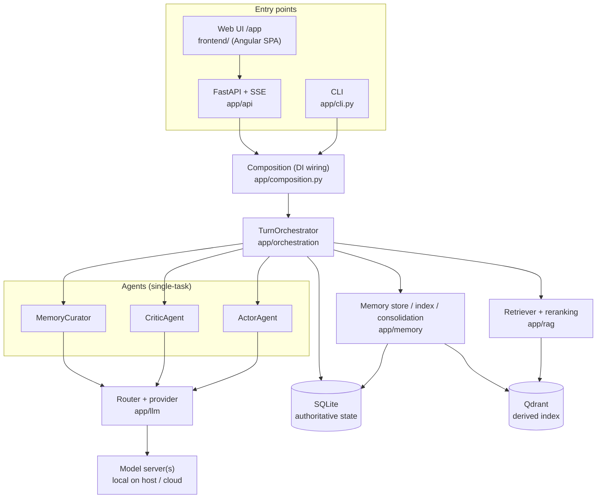
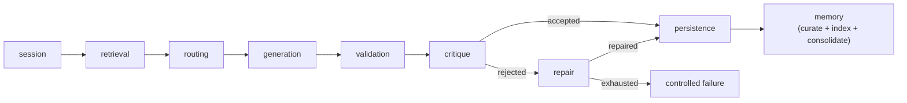
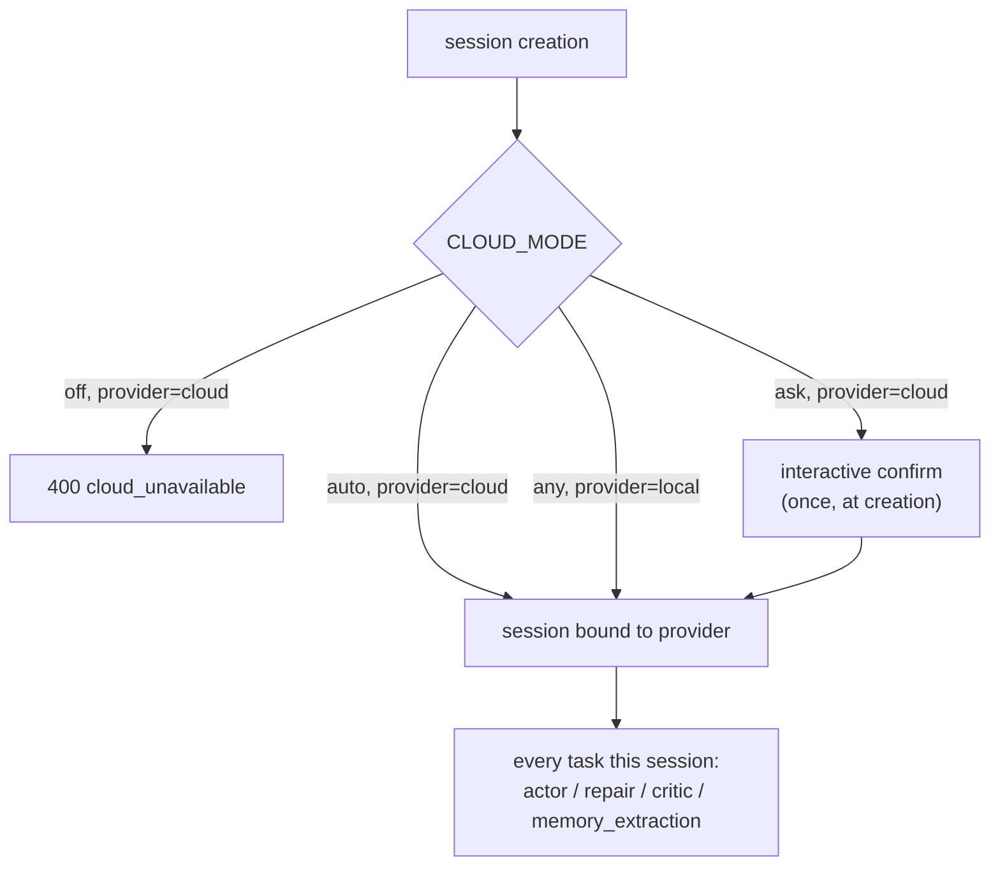

# RoleRAG Documentation

> Reviewed: 2026-07-07 @ 7888ee7

Navigation hub for the RoleRAG docs. New here? Start with the root
[README](../README.md) (setup, Docker, CLI/API usage), then use the diagrams and
index below.

> **Living vs. historical.** "Living" docs are kept in sync with the code. "Reports &
> history" are point-in-time snapshots (acceptance runs, model bake-offs, research) —
> read them as dated records, not current state.

---

## Architecture at a glance

### Components



### Turn pipeline

The orchestrator runs a fixed, bounded sequence of stages per turn
([app/orchestration/turn_orchestrator.py](../app/orchestration/turn_orchestrator.py)).
Each stage's wall-clock time is reported in `stage_timings`.



Retrieval and memory are fail-open: if Qdrant/embeddings are unavailable the turn still
completes, with a warning. Repair runs only when validation/critique reject the draft.

### Session-bound provider routing

Deterministic, never probabilistic ([app/llm/router.py](../app/llm/router.py)). Provider
(`local` or `cloud`) is picked once at session creation and is immutable for the session's
lifetime; every task type — actor, repair, critic, memory extraction — runs on that bound
provider. Structured tasks (critic, memory extraction) pin temperature `0.0` on both providers.



---

## Living docs (kept in sync with code)

| Doc | What it covers |
|-----|----------------|
| [01_product_goal](01_product_goal.md) | Scope, goals, accepted gaps for the personal-use MVP |
| [02_architecture](02_architecture.md) | Current-state architecture and component responsibilities |
| [03_implementation_guide](03_implementation_guide.md) | How to run, test, and extend the app |
| [04_agent_workflows](04_agent_workflows.md) | Actor / critic / repair / memory agent flow |
| [05_rag_memory_design](05_rag_memory_design.md) | Retrieval, reranking, durable memory, dedup, consolidation |
| [06_local_cloud_model_strategy](06_local_cloud_model_strategy.md) | Provider layer, routing, cloud modes, failure handling |
| [08_agent_handoff](08_agent_handoff.md) | Fast onboarding path for a new contributor |
| [09_current_architecture_map](09_current_architecture_map.md) | Module-by-module map for code navigation |
| [10_next_steps_after_mvp](10_next_steps_after_mvp.md) | Safe post-1.0 candidate work |
| [12_api_contract](12_api_contract.md) | HTTP surface: endpoints, shapes, errors, exposure boundaries |
| [17_content_authoring_reference](17_content_authoring_reference.md) | World/scene/persona field schema, player-visible vs. hidden fields, containment |
| [18_security_privacy_and_backups](18_security_privacy_and_backups.md) | Deployment posture (no auth, don't expose the port), cloud egress, data locations, backup/restore runbook |
| [19_verification_and_eval_tooling](19_verification_and_eval_tooling.md) | Live-smoke checkpoint, llama.cpp model profiles + `LLAMA_CPP_*` matrix, model bake-off / secret-containment / RAG-knob harnesses, diagnostics modules |
| [20_playing_rolerag](20_playing_rolerag.md) | Player guide: the `/app/play` surface, session setup + provider choice, reroll, scene/persona switch, memory/canon panels, controlled failures in play, troubleshooting FAQ |
| [21_fable_handoff_reasoning](21_fable_handoff_reasoning.md) | Predecessor-agent handoff (2026-07-07): reasoning chains behind the architecture, analysis method, decision record, working agreements for successor agents |
| [22_rag_scaling_roadmap](22_rag_scaling_roadmap.md) | Verified RAG-core roadmap for larger scenarios on ~27B local models: token budget, eval assets, hybrid retrieval, chunking, long-campaign presets |

## Planning & roadmap

| Doc | What it covers |
|-----|----------------|
| [GLOSSARY](GLOSSARY.md) | Project vocabulary: fail-closed, critic, gating, containment, canon, dual-query retrieval, session-bound provider, and removed concepts |
| [BACKLOG](BACKLOG.md) | Working backlog: done / open / skipped improvements, tagged `(#N)` in commits |
| [CHANGELOG](../CHANGELOG.md) | Release-by-release delta (1.0.0 → current) |
| [SIDE_PROJECTS](SIDE_PROJECTS.md) | Tiered side-project ideas built on top of the engine (effort + dependencies) |

## Reports & history (point-in-time, not current state)

| Doc | Snapshot |
|-----|----------|
| [07_mvp_phases](07_mvp_phases.md) | Phase-by-phase build log through the MVP |
| [11_mvp_acceptance_report](11_mvp_acceptance_report.md) | MVP acceptance baseline |
| [13_live_model_quality_assessment](13_live_model_quality_assessment.md) | 2026-06-08 live model quality findings |
| [14_local_model_comparison_2026-06-08](14_local_model_comparison_2026-06-08.md) | 2026-06-08 small-vs-26B model comparison |
| [15_v1_acceptance_report](15_v1_acceptance_report.md) | 1.0 acceptance baseline |
| [16_mtp_speculative_decoding_2026-06-29](16_mtp_speculative_decoding_2026-06-29.md) | MTP draft vs baseline speed test (100 turns): ~10–14% lossless speedup |

## Background research (design-time references)

| Doc | Note |
|-----|------|
| [RoleRAG_next_steps_implementation_plan](RoleRAG_next_steps_implementation_plan.md) | Earlier roadmap, superseded by the implemented phases |
| [deep-research-report](deep-research-report.md) | Design-time RAG/roleplay research |
| [personal_python_roleplaying_rag_implementation_guide](personal_python_roleplaying_rag_implementation_guide.md) | Earlier implementation guide |

## Implementation plans (executed)

Task-by-task plans that shipped batches of work. They record *how* the work landed, not
current state — see the living docs above for that. See
[superpowers/plans/README.md](superpowers/plans/README.md) for the executed-status and
mandatory-docs-sweep conventions.

| Plan | Delta |
|------|-------|
| [play-experience-v1.2](superpowers/plans/2026-07-01-play-experience-v1.2.md) | Durability, reroll, scene/persona switching, stage SSE, cross-session persona memory (merged 2026-07-01/02) |
| [session-bound-provider](superpowers/plans/2026-07-02-session-bound-provider.md) | Provider bound once at session creation; automatic cloud paths removed (merged 2026-07-02/03) |

`docs/artifacts/` holds supporting assets (e.g. the local-model-comparison run) referenced
by [14_local_model_comparison_2026-06-08](14_local_model_comparison_2026-06-08.md).

---

## Single sources of truth

To stop the docs drifting, each kind of fact has one owning location; other docs should link
rather than restate it.

| Fact | Owner |
|------|-------|
| Config values, defaults, retry/truncation budgets | [`.env.example`](../.env.example) + [app/config.py](../app/config.py) |
| HTTP endpoints, payloads, error codes, `stage_timings` keys | [12_api_contract.md](12_api_contract.md) |
| CLI command inventory | root [README](../README.md) + `python -m app.cli --help` |
| Qdrant collections, retrieval, durable-memory design | [05_rag_memory_design.md](05_rag_memory_design.md) |
| Visibility values & safety boundaries | [02_architecture.md](02_architecture.md) |
| Local/cloud routing rules and cloud modes | [06_local_cloud_model_strategy.md](06_local_cloud_model_strategy.md) |

A 13-doc / 402-claim cross-doc duplication audit found the remaining restatement is consistent and
mostly intentional (safety invariants worth repeating), so it is kept rather than deduped.

---

## Doc maintenance & freshness

Living docs carry a freshness header directly under their H1:

```
> Reviewed: YYYY-MM-DD @ <short-sha>
```

The date is when the doc was last checked against the code; the short SHA is the commit
the doc was reviewed against (usually `HEAD` at review time). A header whose SHA is far
behind `main` is a signal the doc may have drifted and is due for another pass.

**Sweep rule.** Every implementation plan ends with a mandatory "Sweep living docs" task
so shipped behavior and its documentation move together; that task refreshes the `Reviewed:`
headers it touches. See [superpowers/plans/README.md](superpowers/plans/README.md).

**Living docs** (the set the sweep covers, each carrying a `Reviewed:` header):

- root `README.md`, root `CLAUDE.md` (agent entry point), and `frontend/README.md`
- this hub (`docs/README.md`) and the numbered docs `01`–`06`, `08`, `09`, `10`, `12`, `17`–`22`
  (the reasoning chains in `21` are a point-in-time record; its pointers are living)
- `docs/GLOSSARY.md`, `docs/BACKLOG.md`, `docs/SIDE_PROJECTS.md`

Historical reports (`07`, `11`, `13`–`16`) and background design-time docs are *not* living:
their point-in-time banners are their freshness marker instead.

---

*Why no separate GitHub wiki:* for a single-developer personal project, a wiki lives in a
second git repo that drifts from the code. These in-repo docs are the wiki — they version,
review, and diff alongside the code that they describe.
