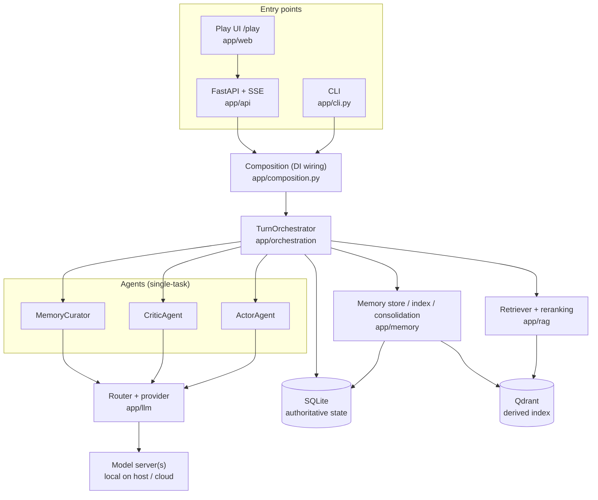
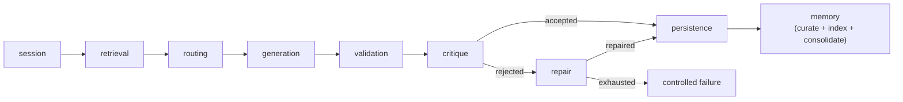
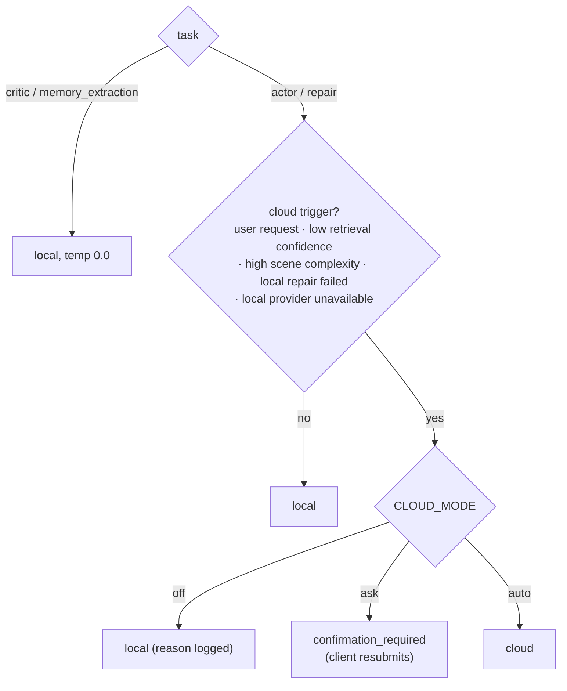

# RoleRAG Documentation

Navigation hub for the RoleRAG docs. New here? Start with the root
[README](../README.md) (setup, Docker, CLI/API usage), then use the diagrams and
index below.

> **Living vs. historical.** "Living" docs are kept in sync with the code. "Reports &
> history" are point-in-time snapshots (acceptance runs, model bake-offs, research) —
> read them as dated records, not current state.

---

## Architecture at a glance

### Components

### Turn pipeline

The orchestrator runs a fixed, bounded sequence of stages per turn
([app/orchestration/turn_orchestrator.py](../app/orchestration/turn_orchestrator.py)).
Each stage's wall-clock time is reported in `stage_timings`.

Retrieval and memory are fail-open: if Qdrant/embeddings are unavailable the turn still
completes, with a warning. Repair runs only when validation/critique reject the draft.

### Local/cloud routing

Deterministic, never probabilistic ([app/llm/router.py](../app/llm/router.py)). Critic and
memory always stay local at temperature `0.0`.

---

## Living docs (kept in sync with code)

| Doc | What it covers |
|-----|----------------|
| [01_product_goal](01_product_goal.md) | Scope, goals, accepted gaps for the personal-use MVP |
| [02_architecture](02_architecture.md) | Current-state architecture and component responsibilities |
| [03_implementation_guide](03_implementation_guide.md) | How to run, test, and extend the app |
| [04_agent_workflows](04_agent_workflows.md) | Actor / critic / repair / memory agent flow |
| [05_rag_memory_design](05_rag_memory_design.md) | Retrieval, reranking, durable memory, dedup, consolidation |
| [06_local_cloud_model_strategy](06_local_cloud_model_strategy.md) | Provider layer, routing, cloud modes, failure handling |
| [08_agent_handoff](08_agent_handoff.md) | Fast onboarding path for a new contributor |
| [09_current_architecture_map](09_current_architecture_map.md) | Module-by-module map for code navigation |
| [10_next_steps_after_mvp](10_next_steps_after_mvp.md) | Safe post-1.0 candidate work |
| [12_api_contract](12_api_contract.md) | HTTP surface: endpoints, shapes, errors, exposure boundaries |

## Reports & history (point-in-time, not current state)

| Doc | Snapshot |
|-----|----------|
| [07_mvp_phases](07_mvp_phases.md) | Phase-by-phase build log through the MVP |
| [11_mvp_acceptance_report](11_mvp_acceptance_report.md) | MVP acceptance baseline |
| [13_live_model_quality_assessment](13_live_model_quality_assessment.md) | 2026-06-08 live model quality findings |
| [14_local_model_comparison_2026-06-08](14_local_model_comparison_2026-06-08.md) | 2026-06-08 small-vs-26B model comparison |
| [15_v1_acceptance_report](15_v1_acceptance_report.md) | 1.0 acceptance baseline |

## Background research (design-time references)

| Doc | Note |
|-----|------|
| [RoleRAG_next_steps_implementation_plan](RoleRAG_next_steps_implementation_plan.md) | Earlier roadmap, superseded by the implemented phases |
| [deep-research-report](deep-research-report.md) | Design-time RAG/roleplay research |
| [personal_python_roleplaying_rag_implementation_guide](personal_python_roleplaying_rag_implementation_guide.md) | Earlier implementation guide |

---

## Single sources of truth

To stop the docs drifting, each kind of fact has one owning location; other docs should link
rather than restate it.

| Fact | Owner |
|------|-------|
| Config values, defaults, retry/truncation budgets | [`.env.example`](../.env.example) + [app/config.py](../app/config.py) |
| HTTP endpoints, payloads, error codes, `stage_timings` keys, `confirmation_required` flow | [12_api_contract.md](12_api_contract.md) |
| CLI command inventory | root [README](../README.md) + `python -m app.cli --help` |
| Qdrant collections, retrieval, durable-memory design | [05_rag_memory_design.md](05_rag_memory_design.md) |
| Visibility values & safety boundaries | [02_architecture.md](02_architecture.md) |
| Local/cloud routing rules and cloud modes | [06_local_cloud_model_strategy.md](06_local_cloud_model_strategy.md) |

A 13-doc / 402-claim cross-doc duplication audit found the remaining restatement is consistent and
mostly intentional (safety invariants worth repeating), so it is kept rather than deduped.

---

*Why no separate GitHub wiki:* for a single-developer personal project, a wiki lives in a
second git repo that drifts from the code. These in-repo docs are the wiki — they version,
review, and diff alongside the code that they describe.
