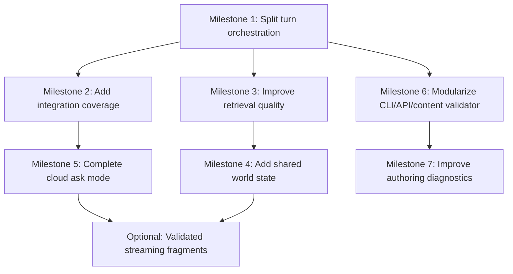

# RoleRAG POC — Next Steps Implementation Plan

> **Historical record** — an earlier planning roadmap, superseded by the implemented phases. Not
> kept in sync with the code. Milestones 1–3 and 5–7 were implemented (Milestone 5's per-turn
> confirmation flow was later removed by the 2026-07-02 session-bound-provider decision); Milestone 4
> (shared world state) was deliberately deferred — see [docs/BACKLOG.md](BACKLOG.md). For current
> state see [docs/README.md](README.md).

**Repository:** `hofdo/RoleRAG_POC`  
**Basis:** Deep research repository review and critical second-pass architecture assessment  
**Purpose:** Convert the review findings into an implementation-ready roadmap for the next development phases.

---

## 1. Executive decision

The project should **not** move into broad feature expansion yet. The repository has already cleared the practical MVP bar: it has a working backend-first roleplay loop, local/cloud model routing, SQLite-backed sessions and turns, Qdrant-backed retrieval, memory curation, critic validation, CLI/API entry points, smoke checks, regression checks, and CI coverage.

The next work should focus on **hardening the architecture before increasing product surface**.

The correct direction is:

1. Split the turn pipeline into explicit stages.
2. Add integration coverage around the real seams.
3. Improve retrieval quality using measurable fixtures.
4. Add a small authoritative shared-world-state layer.
5. Complete `CLOUD_MODE=ask` as a real confirmation flow.
6. Modularize oversized entry-point files.
7. Improve authoring and diagnostics feedback.

Do **not** start with authentication, multi-user support, advanced UI work, agent-framework migration, full token streaming, or training-pipeline work. Those would create more surface area before the current runtime core is easy enough to reason about.

---

## 2. Current state summary

### 2.1 What works well

The repository is strongest in these areas:

- **Clear runtime orientation:** the codebase is a runtime MVP, not a training stack.
- **Good ownership model:** SQLite is authoritative; Qdrant is derived and repairable.
- **Thin model provider abstraction:** local and cloud providers go through one routing seam.
- **Visibility discipline:** player-visible retrieval is filtered before actor prompt construction.
- **Validation-first flow:** critic checks and repair behavior are already present.
- **Operational CLI:** commands exist for session handling, ingest, turn execution, validation, doctor checks, smoke runs, route inspection, and retrieval debugging.
- **Solid verification culture:** unit, integration, frontend, eval, smoke, and CI checks already exist.
- **Content authoring support:** scenario templates and content validation make authored data less fragile than in a typical POC.

### 2.2 What only appears finished

The following parts exist, but should not be considered production-grade yet:

- **Cloud `ask` mode:** routing can mark cloud usage as confirmation-required, but the user-facing confirmation flow is not complete.
- **Retrieval quality:** the pipeline exists, but ranking and query construction are still MVP-level heuristics.
- **Memory:** memory episodes are persisted and indexed, but there is no dedicated mutable shared-world-state tier.
- **Streaming:** buffered SSE is safe, but it is not true incremental validated streaming.
- **Configuration:** some settings suggest configurability that the implementation does not fully honor yet.

### 2.3 Main technical debt

| Debt | Type | Severity | Why it matters |
|---|---:|---:|---|
| `TurnOrchestrator` owns too many lifecycle concerns | Structural | High | Every new feature increases branching, testing cost, and regression risk. |
| `app/cli.py` is too broad | Structural | Medium | CLI command growth will become hard to maintain. |
| `app/api/routes.py` is too broad | Structural | Medium | API responsibilities are not separated cleanly enough by resource area. |
| Retrieval ranking is heuristic and shallow | Structural | High | Roleplay quality depends heavily on recall, relevance, visibility, and continuity. |
| No authoritative shared-world-state layer | Structural | High | Mutable world facts are currently not modeled as first-class state. |
| `CLOUD_MODE=ask` lacks completed confirmation UX | Product-flow debt | Medium | A documented safety mode is not fully usable yet. |
| Config drift around retry behavior | Incidental-to-structural | Medium | A visible setting that does not fully control runtime behavior misleads operators. |
| Ingestion only supports `.md` and `.txt` | Deferred scope | Low now, Medium later | Fine for MVP; becomes limiting once corpus governance matters. |

---

## 3. Roadmap overview



The sequencing is intentional:

- **Milestone 1 comes first** because the turn pipeline is the core coordination point.
- **Milestone 2 follows immediately** because refactoring without broader seam tests is reckless.
- **Milestone 3 comes before shared world state** because retrieval behavior should be measured before another state source is added.
- **Milestone 4 adds the missing architectural layer** once retrieval has enough test evidence.
- **Milestone 5 completes an already-documented safety feature.**
- **Milestones 6 and 7 reduce maintenance cost and improve developer/content-author experience.**
- **Streaming remains optional** because the current validation-first buffered response is safer than naive provider-token streaming.

---

## 4. Milestone 1 — Split the turn orchestration pipeline

### Goal

Reduce `TurnOrchestrator` from a broad lifecycle god-object into a coordinator over explicit stage services.

### Why this must be next

The orchestrator currently carries too many responsibilities: session validation, retrieval, route selection, actor generation, critic checks, repair handling, persistence, memory curation, memory indexing, and warning aggregation. That is still manageable now, but it will become the main blocker for every future feature.

Do not add shared world state or richer retrieval before this seam is cleaner.

### Proposed design

Keep the public orchestrator contract stable, but extract internal services:

```text
TurnOrchestrator
├── TurnSessionLoader
├── TurnRetrievalStage
├── TurnRoutingStage
├── TurnGenerationStage
├── TurnCritiqueStage
├── TurnRepairStage
├── TurnPersistenceStage
└── TurnMemoryStage
```

The orchestrator should become responsible for ordering, not implementation detail.

### Implementation steps

1. Create an `app/orchestration/stages/` package.
2. Extract session loading and validation into `TurnSessionLoader`.
3. Extract retrieval construction and retriever invocation into `TurnRetrievalStage`.
4. Extract route decision input construction into `TurnRoutingStage`.
5. Extract actor call and draft generation into `TurnGenerationStage`.
6. Extract critic invocation and result normalization into `TurnCritiqueStage`.
7. Extract bounded repair behavior into `TurnRepairStage`.
8. Extract session/turn persistence into `TurnPersistenceStage`.
9. Extract memory curation and indexing into `TurnMemoryStage`.
10. Keep `TurnResult`, API responses, CLI output, and persistence schema unchanged.

### Suggested file changes

```text
app/orchestration/turn_orchestrator.py
app/orchestration/stages/__init__.py
app/orchestration/stages/session_loader.py
app/orchestration/stages/retrieval_stage.py
app/orchestration/stages/routing_stage.py
app/orchestration/stages/generation_stage.py
app/orchestration/stages/critique_stage.py
app/orchestration/stages/repair_stage.py
app/orchestration/stages/persistence_stage.py
app/orchestration/stages/memory_stage.py
```

### Acceptance criteria

- Existing CLI/API behavior remains unchanged.
- Existing tests pass without broad fixture rewrites.
- `TurnOrchestrator` primarily coordinates stages and no longer owns all details directly.
- Each stage has a narrow constructor and clear input/output type.
- Repair behavior remains bounded and deterministic.
- Memory persistence remains authoritative in SQLite before Qdrant indexing.
- Retrieval failure still degrades gracefully instead of aborting the turn.

### Tests to add

- Unit test for each stage’s success path.
- Unit test for retrieval failure warning behavior.
- Unit test for repair failure routing behavior.
- Contract test proving the orchestrator still returns the same shape of `TurnResult`.
- Regression test proving no GM-only or hidden content reaches actor-visible context.

### Risks

| Risk | Mitigation |
|---|---|
| Refactor introduces subtle behavior drift | Keep public contract stable and add characterization tests before extraction. |
| Stage interfaces become too abstract | Use concrete dataclasses and current domain types. Do not introduce a generic pipeline framework. |
| Too much moved at once | Extract one stage per commit or phase. |

---

## 5. Milestone 2 — Broaden integration coverage around real seams

### Goal

Protect the system where failures would actually hurt: CLI/API → orchestration → persistence → retrieval → route selection.

### Why now

The repo already has good verification for an MVP, but the next refactors need better seam coverage. Unit tests alone will not catch wiring drift between composition, settings, persistence, retrieval, and route behavior.

### Implementation steps

1. Add a deterministic CLI integration test that starts a session and executes a turn with fake providers.
2. Add an API integration test for session creation plus turn execution.
3. Add a persistence integration test verifying stored route metadata and restored session state.
4. Add a retrieval integration test using an in-memory or test vector-store substitute.
5. Add a memory indexing degradation test: SQLite write succeeds even if indexing fails.
6. Add a cloud-routing test matrix for `off`, `ask`, and fallback-enabled modes.
7. Add one optional CI job that boots Qdrant as a service and runs retrieval wiring tests.

### Acceptance criteria

- CI still has a fast default path.
- Service-backed Qdrant tests are optional or isolated.
- Fake-provider tests remain deterministic.
- Cloud routes are tested without calling real cloud APIs.
- Failure modes are asserted, not just happy paths.

### Tests to add

```text
tests/integration/test_cli_turn_flow.py
tests/integration/test_api_turn_flow.py
tests/integration/test_route_metadata_persistence.py
tests/integration/test_memory_indexing_degradation.py
tests/integration/test_cloud_mode_matrix.py
tests/integration/test_qdrant_wiring_optional.py
```

### Risks

| Risk | Mitigation |
|---|---|
| CI becomes slow | Keep service-backed tests optional or separate. |
| Tests overfit current internals | Assert public behavior and stored outcomes, not private method calls. |
| Fake providers hide integration issues | Add one minimal Qdrant-backed wiring test without real LLM calls. |

---

## 6. Milestone 3 — Improve retrieval quality from evidence

### Goal

Move retrieval from “working baseline” to measurable roleplay continuity support.

### Why this matters

Retrieval quality is one of the main determinants of roleplay quality. The current implementation has useful MVP heuristics, but it does not yet fully capture scene commitments, relationship state, recent promises, unresolved facts, or world-state changes.

### Implementation steps

1. Create a small retrieval evaluation fixture set.
2. Add cases for:
   - promise recall,
   - relationship recall,
   - scene-specific recall,
   - hidden/public visibility separation,
   - lore recall,
   - irrelevant-memory suppression.
3. Extend retrieval query construction with:
   - current scene ID and title,
   - current location,
   - active persona,
   - recent player commitments,
   - recent NPC commitments,
   - relationship tags,
   - unresolved tasks or open loops.
4. Improve ranking with:
   - recency weighting,
   - tag overlap,
   - scene match,
   - persona match,
   - importance score,
   - source-type priority,
   - duplicate suppression.
5. Add debug output explaining why each chunk was selected.
6. Add a retrieval report command or extend `retrieve-debug` with scoring breakdown.

### Suggested file changes

```text
app/rag/retriever.py
app/rag/ranking.py
app/orchestration/context_builder.py
app/orchestration/context_budget.py
app/cli.py or new cli/rag_commands.py
tests/evals/retrieval_quality_cases.json
tests/evals/test_retrieval_quality.py
```

### Acceptance criteria

- Retrieval evals exist and can fail meaningfully.
- Selected chunks expose a reason/scoring breakdown in debug mode.
- Player-visible filtering remains enforced after ranking.
- Retrieval improves recall for commitments and scene facts without increasing hidden-info leakage.
- Ranking behavior is deterministic enough to test.

### Risks

| Risk | Mitigation |
|---|---|
| Ranking becomes arbitrary magic | Keep every boost named and visible in debug output. |
| Retrieval overfits fixtures | Include negative cases and irrelevant-memory suppression. |
| Hidden facts leak through richer context | Keep visibility filtering as a hard post-rank gate before prompt assembly. |

---

## 7. Milestone 4 — Add authoritative shared world state

### Goal

Introduce first-class mutable world facts that are neither raw turns nor generic memory episodes.

### Why this is the biggest architecture gap

The historical design direction calls for a separation between episodic memory, persona memory, canon lore, and mutable shared world state. The current repository has sessions, turns, memory episodes, and retrievable chunks, but not a dedicated state tier for authoritative facts like:

- NPC is wounded.
- Door is unlocked.
- Player promised to meet someone at dawn.
- Faction hostility changed.
- Item moved from one character to another.
- A secret became revealed.

Without this layer, too much burden falls onto memory retrieval and recent-turn context.

### Proposed data model

Add a SQLite table such as:

```sql
CREATE TABLE world_facts (
    id TEXT PRIMARY KEY,
    session_id TEXT NOT NULL,
    world_id TEXT NOT NULL,
    scene_id TEXT,
    subject TEXT NOT NULL,
    predicate TEXT NOT NULL,
    object TEXT NOT NULL,
    visibility TEXT NOT NULL,
    source_turn_id TEXT,
    confidence REAL NOT NULL DEFAULT 1.0,
    status TEXT NOT NULL DEFAULT 'active',
    created_at TEXT NOT NULL,
    updated_at TEXT NOT NULL
);
```

Keep SQLite authoritative. Qdrant may index world facts later, but must remain derived.

### Implementation steps

1. Add `world_facts` table and repository methods.
2. Define `WorldFact` domain model.
3. Add simple extraction rules from memory curator output or critic-approved deltas.
4. Add world-state retrieval to context building.
5. Ensure visibility filtering applies to world facts.
6. Add fact update semantics:
   - insert new fact,
   - supersede old fact,
   - mark fact resolved,
   - mark fact revealed.
7. Add world-state debug command.
8. Add tests for fact insertion, update, visibility, and retrieval.

### Suggested file changes

```text
app/domain/world_state.py
app/persistence/sqlite.py
app/persistence/repositories.py
app/orchestration/stages/memory_stage.py
app/orchestration/context_builder.py
app/rag/retriever.py optional
app/cli.py or cli/world_state_commands.py
tests/unit/test_world_state_repository.py
tests/integration/test_world_state_turn_flow.py
```

### Acceptance criteria

- Mutable world facts are persisted independently of raw turns.
- World facts can be retrieved for later turns.
- Hidden world facts do not reach actor-visible prompts unless revealed.
- Updated facts supersede stale facts.
- Debug output shows active world facts for a session.
- Qdrant indexing failure cannot lose world facts.

### Risks

| Risk | Mitigation |
|---|---|
| Fact extraction becomes unreliable | Start with explicit structured deltas and conservative extraction. |
| Contradictory facts accumulate | Add status/supersession semantics immediately. |
| World facts duplicate memory episodes | Treat memory as narrative recollection; world facts as authoritative state. |

---

## 8. Milestone 5 — Complete `CLOUD_MODE=ask`

### Goal

Turn cloud confirmation from a route flag into a complete user flow.

### Current problem

The router can decide that a cloud route requires confirmation, but the runtime does not yet provide a full confirmation loop or dedicated confirmation endpoint. That means the safety policy exists internally but is incomplete as a product interaction.

### Proposed behavior

When cloud use is required in `ask` mode:

1. The turn does not call the cloud provider immediately.
2. The system returns a confirmation-required response.
3. The response includes:
   - reason cloud was requested,
   - route decision metadata,
   - provider/model target,
   - a confirmation token or pending-turn ID.
4. User confirms or rejects.
5. Confirmed execution continues with the same captured context.
6. Rejected execution returns a local-only failure or degraded local response.

### CLI implementation

Add one of these:

```bash
rolerag turn --session-id ... --message ... --allow-cloud-once
```

or:

```bash
rolerag confirm-cloud --pending-turn-id ...
```

The first option is simpler. The second option is cleaner for API parity.

### API implementation

Add a dedicated endpoint:

```http
POST /sessions/{session_id}/turns/{pending_turn_id}/confirm-cloud
```

or make the existing turn endpoint accept:

```json
{
  "message": "...",
  "cloud_confirmation": true
}
```

The dedicated pending-turn contract is safer if the exact same context must be reused.

### Acceptance criteria

- `CLOUD_MODE=ask` never calls cloud silently.
- Confirmation-required responses are clear and machine-readable.
- CLI has a usable approval path.
- API has a usable approval path.
- Tests prove `off`, `ask`, and fallback modes behave differently.
- Confirmed cloud execution preserves the original route reason.

### Risks

| Risk | Mitigation |
|---|---|
| Pending context becomes stale | Store a pending-turn snapshot with expiry. |
| Confirmation flow complicates API | Keep the response schema explicit and narrow. |
| User accidentally approves all future cloud calls | Use one-shot approval unless a later setting explicitly changes that. |

---

## 9. Milestone 6 — Modularize CLI, API routes, and content validation

### Goal

Reduce file-level cognitive load and make future changes easier to isolate.

### Why this should happen after orchestration cleanup

The CLI and API are broad partly because they expose many orchestration capabilities. Once orchestration is split, entry-point modules can become thinner naturally.

### Implementation steps

Split CLI commands by concern:

```text
app/cli/__init__.py
app/cli/main.py
app/cli/session_commands.py
app/cli/turn_commands.py
app/cli/rag_commands.py
app/cli/content_commands.py
app/cli/diagnostic_commands.py
app/cli/route_commands.py
```

Split API routes by resource:

```text
app/api/routes/__init__.py
app/api/routes/play.py
app/api/routes/sessions.py
app/api/routes/turns.py
app/api/routes/content.py
app/api/routes/diagnostics.py
```

Split validator concerns:

```text
app/content/validation/catalog_validation.py
app/content/validation/visibility_validation.py
app/content/validation/lore_validation.py
app/content/validation/reference_validation.py
```

### Acceptance criteria

- CLI commands remain backward compatible.
- API routes remain backward compatible.
- Imports remain simple from application composition.
- Tests do not need broad rewrites.
- Each module has one obvious reason to change.

### Risks

| Risk | Mitigation |
|---|---|
| Import cycles | Keep command modules thin and inject dependencies from composition helpers. |
| Typer/FastAPI registration gets messy | Centralize registration in `main.py` / route package init. |
| Pure churn with no value | Only split along existing command/resource boundaries. |

---

## 10. Milestone 7 — Improve authoring diagnostics and project handoff quality

### Goal

Make the project easier to use, debug, and extend without needing to understand every internal module.

### Implementation steps

1. Improve `validate-content` output with remediation hints.
2. Extend scenario templates with comments or adjacent README files.
3. Add example files for common mistakes:
   - hidden fact accidentally public,
   - missing scene reference,
   - orphan lore document,
   - unsupported document suffix.
4. Add docs tests for command examples.
5. Add a `docs/current_next_steps.md` generated from this roadmap.
6. Update `README.md` to clearly distinguish:
   - current MVP capabilities,
   - experimental features,
   - planned features,
   - historical research docs.

### Acceptance criteria

- A new developer can run the local flow from README without guessing.
- A content author can validate a scenario and understand errors.
- Historical research is clearly labeled as background, not current backlog.
- Next implementation steps are discoverable from docs.

### Risks

| Risk | Mitigation |
|---|---|
| Docs drift again | Add docs command tests and link docs to actual CLI commands. |
| Templates become too complex | Keep generated templates minimal but include optional examples. |

---

## 11. Optional milestone — Validated streaming fragments

### Decision

Do not implement full provider-token streaming now.

The current buffered SSE behavior is safe because it emits output only after orchestration and validation. Naive token streaming would bypass the critic boundary and could leak or emit invalid output before checks run.

### Only implement if UX becomes a priority

If streaming becomes necessary, use validated fragments:

1. Generate full draft internally.
2. Run critic validation and repair.
3. Split approved output into chunks.
4. Stream approved chunks.

This is not true low-latency model streaming, but it preserves validation-first semantics.

### Acceptance criteria

- No pre-validation provider tokens are streamed.
- Critic and repair still run before user-visible output.
- API contract clearly states buffered/validated streaming semantics.

---

## 12. What should explicitly not be done next

### Do not add authentication yet

The repo is still a local-first/personal-use runtime. Auth adds operational surface without improving the engine core.

### Do not build multi-user support yet

Multi-user support requires stronger state isolation, authorization, persistence migrations, and possibly tenancy boundaries. That is premature.

### Do not migrate to an agent framework

The current strength is deterministic orchestration and explicit state ownership. Hiding this in a generic agent framework would likely reduce clarity.

### Do not start a training pipeline inside this repo

This repository is a runtime POC. Training/data-generation work should remain separate unless the project direction changes deliberately.

### Do not implement naive token streaming

It conflicts with the validation-first safety boundary.

### Do not expand document ingestion broadly yet

PDF, HTML, and web ingestion are useful later, but retrieval quality and state semantics should come first.

---

## 13. Recommended execution phases for coding agents

### Phase A — Characterization before refactor

**Goal:** Lock current behavior before extracting stages.

Tasks:

- Add characterization tests for one normal local turn.
- Add characterization tests for critic repair.
- Add characterization tests for retrieval failure degradation.
- Add characterization tests for memory persistence.
- Add characterization tests for cloud `ask` route marking.

Do not refactor until these tests pass.

### Phase B — Orchestrator extraction

**Goal:** Extract stage services without behavior changes.

Tasks:

- Extract one stage at a time.
- Keep public return types unchanged.
- Run tests after each extraction.
- Do not introduce new abstractions beyond concrete stage classes.

### Phase C — Integration hardening

**Goal:** Prove the full runtime path still works.

Tasks:

- Add CLI integration tests.
- Add API integration tests.
- Add persistence and route metadata tests.
- Add failure-path tests.

### Phase D — Retrieval evaluation and ranking

**Goal:** Make retrieval quality measurable.

Tasks:

- Add retrieval fixture cases.
- Add score explanations.
- Add ranking improvements.
- Add hidden-info regression tests.

### Phase E — Shared world state

**Goal:** Add authoritative mutable facts.

Tasks:

- Add schema.
- Add repository.
- Add domain model.
- Add simple extraction/update flow.
- Add debug command.
- Add tests.

### Phase F — Cloud confirmation

**Goal:** Finish `CLOUD_MODE=ask`.

Tasks:

- Add pending confirmation representation.
- Add CLI approval path.
- Add API approval path.
- Add tests for approval and rejection.

---

## 14. Minimal prompt for the next coding milestone

Use this prompt for the next implementation phase:

```text
Review the current RoleRAG_POC repository and implement the next milestone: characterization tests before orchestrator refactoring.

Goal:
Lock down current behavior before changing TurnOrchestrator internals.

Scope:
1. Add tests for a normal local turn using fake providers.
2. Add tests for critic repair behavior.
3. Add tests for retrieval failure degradation.
4. Add tests proving memory persistence still succeeds even if indexing fails.
5. Add tests for CLOUD_MODE=ask route marking without calling cloud.

Constraints:
- Do not refactor production code yet unless a tiny testability seam is absolutely required.
- Do not call real local or cloud LLMs.
- Keep tests deterministic.
- Preserve existing CLI/API contracts.
- Run the full existing test suite and report any failures.

Deliverable:
A short implementation summary listing added tests, covered behavior, and any production-code changes made.
```

---

## 15. Definition of done for the next roadmap block

The next block of work should be considered complete when:

- `TurnOrchestrator` is split into explicit stages.
- Integration tests cover CLI/API/persistence/retrieval/routing seams.
- Retrieval eval fixtures exist and are part of normal regression checks.
- Retrieval debug output explains scoring and selection.
- Mutable world facts are first-class SQLite-backed state.
- `CLOUD_MODE=ask` has a complete CLI/API confirmation path.
- CLI/API files are split by concern without breaking public commands/routes.
- Docs clearly separate current implementation, next steps, and historical research.

At that point, the project can safely move from MVP-hardening into product expansion.

---

## 16. Final recommendation

The project is in a good state, but the next decisions matter. The dangerous path is to add more visible features while the core turn lifecycle is still concentrated in one orchestrator and retrieval quality is still heuristic. The disciplined path is to refactor the core seams, protect them with integration tests, then deepen retrieval and world-state semantics.

The next milestone should therefore be:

> **Add characterization tests for the current turn pipeline before refactoring `TurnOrchestrator`.**

That is the least glamorous step, but it is the correct engineering move.
