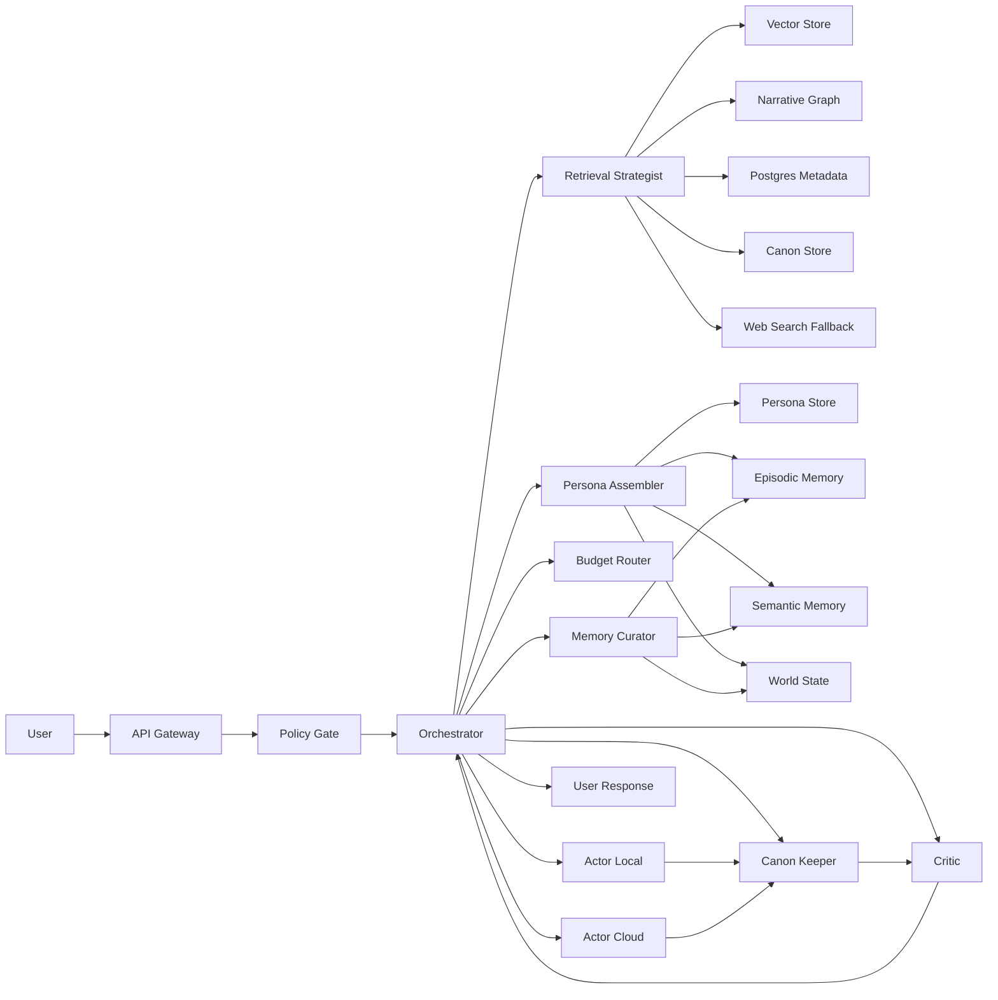
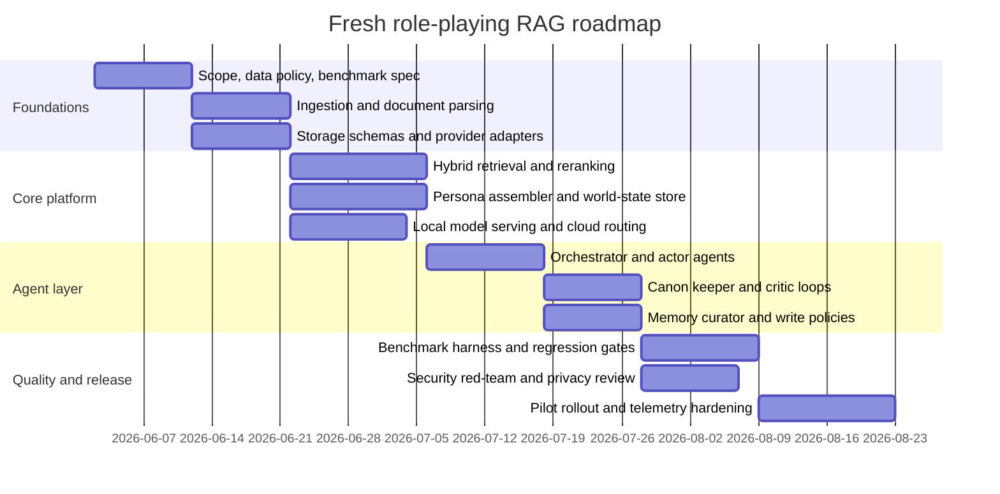

# Role-Playing Multi-Agent RAG Plan for Local and Cloud LLMs

> Status: historical research reference. For implemented MVP behavior, setup, and contributor guidance, use [README.md](../README.md), [docs/08_agent_handoff.md](08_agent_handoff.md), and [docs/09_current_architecture_map.md](09_current_architecture_map.md).
>
> The inline `cite…` tokens throughout this document are artifacts of the research tool that produced it and do not resolve to sources.

## Executive summary

The paper at arXiv:2601.10122v1 is valuable as a **field map** for role-playing language agents, but it is **not** a system paper in the usual engineering sense. Its strongest contribution is a taxonomy: role-playing systems have moved from rule/template methods, to style imitation, and then to personality-, memory-, and behaviour-driven agents. The paper also usefully organises the field around five practical concerns: personality modelling, memory mechanisms, behaviour and decision control, role-specific data construction, and evaluation. However, it does not itself provide a novel end-to-end architecture, a reproducible experimental package, or an implementation blueprint. citeturn2view0turn4view0turn5view0

For a multi-agent role-playing RAG system, the most actionable ideas from the paper are these: treat persona as **structured state** rather than loose prompt prose; use **scenario-specific memory assembly** instead of dumping all history into context; keep **private and shared memories separate** across agents; anchor conversations to a **timeline or scene state** to reduce “point-in-time” hallucinations; and evaluate not only answer quality, but also personality fidelity, behavioural rationality, value alignment, and temporal consistency. Those ideas align well with later RAG and agent research such as Self-RAG, CRAG, GraphRAG, RAPTOR, Generative Agents, and MemGPT-style memory hierarchies. citeturn4view0turn5view0turn24search1turn24search2turn24search3turn25search0turn25search3turn26search0

The architecture I recommend is a **fresh hybrid design** built for enterprise-grade role-play applications: a policy gate, an orchestrator, a retrieval strategist, a persona assembler, one or more actor agents, a canon keeper, a memory curator, and a critic/evaluator. Local models should handle sensitive ingestion, embeddings, reranking, safety classification, cheap drafting, memory extraction, and most background work. Cloud models should be reserved for difficult reasoning, large-context synthesis, multilingual edge cases, and high-value final responses. A unified provider layer should target OpenAI-style APIs where possible, because OpenAI’s Responses API, vLLM, and Ollama all support closely related interfaces, which reduces switching costs between local and hosted inference. citeturn19search1turn19search3turn14search3turn14search7turn15search21

Several planning-critical details are **unspecified** by your brief: target domain, expected concurrency, latency SLOs, acceptable monthly spend, Swiss hosting requirements, moderation requirements, multilingual scope beyond English, and whether fine-tuning is allowed. The design below therefore assumes a general enterprise/internal-knowledge role-play setting, with sensitive data present, moderate concurrency, and a preference for Swiss-compliant privacy handling where feasible. citeturn23search1turn23search10turn23search12

## Paper analysis

The paper is best read as a **narrative survey** of role-playing language agents rather than as a novel algorithmic contribution. The abstract explicitly frames it as a systematic review of the development, technologies, data, evaluation, and future directions of role-playing agents, and the body is organised accordingly into paradigm evolution, core technologies, role-specific data construction, evaluation, future directions, and conclusion. In practical terms, that means it is good for extracting design principles and benchmark pointers, but not for re-running a published system exactly as-is. citeturn2view0turn7view0turn12view0

The paper’s implicit “architecture” is not a software stack but a **conceptual pipeline**. It treats high-quality role-play as the interaction of personality modelling, explicit memory, behavioural reasoning, structured corpus building, and multi-dimensional evaluation. Its most operational diagram is Figure 1, which stages corpus construction as corpus screening, character extraction and name disambiguation, situation and behaviour annotation, multi-dimensional annotation design, and manual review. That is genuinely useful for a role-play RAG system because it translates well into ingestion, indexing, and memory-writing services. citeturn4view0turn8view0turn9view0

Algorithmically, the paper surveys three families of methods that matter directly for engineering. First, personality modelling ranges from questionnaire- or scale-driven supervision to self-supervised character induction; the paper explicitly contrasts supervised MBTI/Big Five-like conditioning with self-supervised systems such as Ditto’s WIKIROLE-style induction. Secondly, it foregrounds **memory-augmented prompting**, especially MAP-style designs with a generator and an external memory retriever, and it highlights CHARMAP as a stronger scene-specific memory construction method. Thirdly, it treats behaviour as something that must be constrained by the causal chain **personality → motivation → situation**, rather than by style prompting alone; this is where “given circumstances”, narrative chains, and plot triggers enter. citeturn4view0turn11view2turn38view5turn38view6

The paper is also strong on benchmark coverage. It summarises role-knowledge, personality-fidelity, behavioural, temporal, interactive-hallucination, user-centric, and value-alignment benchmarks. Concretely: RoleEval covers 300 characters with 6,000 bilingual MCQs; CharacterEval contains 1,785 multi-turn dialogues, 11,376 examples, 77 characters, and 13 metrics across four dimensions; RoleLLM’s RoleBench contains 168,093 samples; InCharacter tests 32 characters on 14 psychological scales and reports personality-fidelity accuracy up to 80.7%; TimeChara contains 10,895 instances for point-in-time hallucination; and RMTBench shifts evaluation towards 80 user-centric characters and more than 8,000 dialogue rounds. The survey also flags RVBench for value alignment. citeturn5view0turn39view3turn39view2turn39view0turn38view4turn38view3turn36view0turn37search0

On experiments, the paper mostly **repeats and interprets prior results** rather than presenting original runs. Its most engineering-relevant reported findings are that CHARMAP improves LifeChoice decision accuracy over naive memory concatenation, CharacterRM correlates better with human judgement than GPT-4 in CharacterEval, and CoSER-70B reportedly achieved 93.47% on LIFECHOICE in multi-character English novels. This makes the paper a decent evidence aggregator, but you should treat performance numbers as **secondary reports** unless you verify them against the primary sources. citeturn38view5turn39view2turn11view2

Its limitations are significant. I would classify it as a **narrative review, not a full systematic review**, because the arXiv version does not visibly provide a database search protocol, inclusion/exclusion criteria, or a reproducible literature-screening method. Reproducibility is therefore low at the survey artefact level. The paper itself also acknowledges a deeper field-wide problem: open, high-quality, structured role datasets are scarce; many role corpora come from copyrighted novels, scripts, and anime; and even “open” resources are often limited in scale or commercial usability. That matters a lot for any production design, because it pushes you towards either licensed/internal corpora or carefully governed synthetic generation. citeturn2view0turn5view0turn41view2

## Transferable techniques and ecosystem survey

The most useful techniques to carry from this paper into multi-agent RAG are not the role-play tricks that people normally focus on, such as “speak like character X”. They are the structural ideas.

The first is **scene-specific persona assembly**. CHARMAP’s core insight is that retrieval should be guided by the *current scenario* and not merely by a static biography. That is directly portable to role-play RAG: build a “scene packet” from role, time anchor, user intent, active relationships, and current constraints; then retrieve against that packet rather than against the raw user message alone. It is one of the cleanest ways to reduce role drift and context sprawl. citeturn38view5turn38view6

The second is **hierarchical memory**. The survey’s MAP framing, Generative Agents’ observation/planning/reflection architecture, and MemGPT/Letta’s multi-tier memory view all point in the same direction: short-term context, episodic memory, semantic summaries, and stable persona/core memory should not be collapsed into one vector store. Role-play systems need at least four memory tiers: always-on persona memory, session episodic memory, semantic long-term memory, and shared world state. citeturn4view0turn25search3turn26search0turn26search2turn26search8

The third is **retrieval quality control**. Self-RAG learns when to retrieve and when to critique; CRAG adds a retrieval evaluator and corrective actions; GraphRAG adds structured graph extraction for global/narrative questions; and RAPTOR adds hierarchical summaries for long documents. Together, they suggest a robust role-play retrieval stack: hybrid dense+sparse retrieval for lexical and semantic match, graph retrieval for relationships and world consistency, and a critic that can force re-retrieval or ask a clarifying question before an actor responds in character. citeturn24search1turn24search2turn24search3turn24search11turn25search0

The fourth is **evaluation beyond answer correctness**. CharacterEval, InCharacter, TimeChara, SHARP, RMTBench, and RVBench collectively show that role-play systems fail along axes that normal RAG metrics miss: value misalignment, temporal leakage, inconsistent behaviour, poor user-intent fulfilment, and interactive hallucination. If you do not instrument those failure modes from day one, the system will look good in demos and then break in actual dialogue. citeturn39view2turn38view4turn36view0turn37search0turn5view0

### Survey of relevant resources

| Resource | Type | Short annotation | Why it matters for this project | Source |
|---|---|---|---|---|
| Retrieval-Augmented Generation for Knowledge-Intensive NLP Tasks | Paper | Introduced the canonical parametric + non-parametric memory setup for grounded generation. | Baseline conceptual model for any RAG layer. | citeturn24search0 |
| Self-RAG | Paper | Adds retrieval-on-demand and self-critique/reflection tokens. | Good template for retrieval gating and critic loops. | citeturn24search1 |
| Corrective Retrieval-Augmented Generation | Paper | Introduces retrieval-quality evaluation and corrective actions, including web extension. | Strong fit for fallback and confidence routing. | citeturn24search2 |
| GraphRAG | Paper + implementation | Builds knowledge graphs and summary layers over private corpora. | Useful for narrative/world-state and relationship retrieval. | citeturn24search3turn25search1 |
| RAPTOR | Paper | Recursively embeds, clusters, and summarises into a retrieval tree. | Helps with long canon documents and high-level scene summaries. | citeturn25search0 |
| Generative Agents | Paper | Uses observation, planning, reflection, and dynamic memory retrieval. | Directly relevant to believable multi-character behaviour. | citeturn25search3 |
| MemGPT | Paper | Treats memory as a hierarchy managed relative to a limited context window. | Good mental model for long-lived role-play memory. | citeturn26search0 |
| Character-LLM | Paper | Trains role-playing agents around profiles, experiences, and emotional states. | Early trainable role-play baseline for persona conditioning. | citeturn40view0 |
| ChatHaruhi | Paper + code/data | Uses improved prompting plus script-derived memories; dataset covers 32 characters and 54k+ dialogues. | Direct precedent for memory-grounded character acting. | citeturn41view0turn41view2 |
| RoleLLM and RoleBench | Paper | Four-stage pipeline with 100 roles and RoleBench at 168,093 samples. | Excellent source for synthetic role-conditioning and evaluation ideas. | citeturn39view0turn39view1 |
| CharacterEval and CharacterRM | Paper | Chinese benchmark with 1,785 dialogues, 77 characters, 13 metrics, plus a human-annotated reward model. | Strong template for role-play-specific evaluation dimensions. | citeturn39view2turn39view3 |
| InCharacter | Paper | Measures personality fidelity using 14 psychological scales across 32 characters. | Best source for personality-consistency testing. | citeturn38view3turn38view4 |
| TimeChara | Paper | Benchmarks point-in-time character hallucination with 10,895 instances. | Essential if your roles evolve over timelines or stories. | citeturn36view0 |
| Character is Destiny and LifeChoice | Paper | Introduces persona-driven decision prediction and CHARMAP; LifeChoice draws from 395–396 books and 1,401 character decisions. | Best inspiration for scene-specific memory retrieval and behavioural tests. | citeturn38view5turn38view6 |
| RMTBench | Paper | User-centric bilingual role-play benchmark with 80 characters and 8,000+ rounds. | Better aligned with product reality than purely character-centric tests. | citeturn37search0 |

### Comparison of alternatives

The table entries below synthesise official/primary documentation. The “fit” and “pros/cons” judgements are mine; the capabilities and product characteristics come from the cited sources.

#### LLM options

| Option | Best fit | Main strengths | Main trade-offs | Source |
|---|---|---|---|---|
| OpenAI GPT family via Responses API | Cloud finaliser, tool-heavy orchestration, subagents | Official stateful Responses API, built-in tools, strong model ladder from frontier to mini, broad SDK support. | Cloud dependency; premium tiers can become expensive quickly. | citeturn19search0turn19search1turn19search3turn17search0 |
| Claude Sonnet and Haiku | Cloud reasoning/critique and high-quality writing | Strong capability/speed/cost model ladder, good tool support, clear batch and caching pricing. | Global-first routing and endpoint distinctions complicate governance. | citeturn15search3turn15search7turn33view1turn33view3 |
| Gemini 2.5 Pro and Gemini 3 | Cloud long-context synthesis and grounded search | Very long context options, search grounding, broad pricing tiers. | Cost grows materially with premium tiers and grounded prompts. | citeturn20search16turn20search0turn32view1 |
| Llama family | Local/self-hosted actor and draft models | Strong ecosystem, open-weight availability, multilingual/coding/tool-use lineage; small quantised variants exist. | Operational burden is yours; larger checkpoints need serious hardware. | citeturn22search15turn22search13turn22search17 |
| Gemma family | Local privacy-first deployments and smaller nodes | Lightweight, multimodal, positioned for single-GPU/TPU and constrained environments. | Smaller ecosystem than Llama; model choice depends heavily on your retrieval quality. | citeturn20search3turn20search13turn20search17 |
| Qwen3 family | Local multilingual, agentic, and coding-heavy work | Open weights across dense and MoE variants, strong multilingual positioning, active agent/coding ecosystem. | Quality/operational stability depends on checkpoint and serving stack choice. | citeturn21search0turn21search1turn21search11 |

#### Vector database options

| Option | Best fit | Main strengths | Main trade-offs | Source |
|---|---|---|---|---|
| Qdrant | Hybrid retrieval with custom scoring | Dense+sparse+multivector support, RRF/DBSF fusion, formula-based scoring. | Extra retrieval sophistication can increase tuning complexity. | citeturn14search0turn14search12turn14search16 |
| Weaviate | Managed-search style RAG backends | Hybrid BM25F+vector, reranking and RAG-oriented features in one platform. | Feature-rich platform can feel heavier than needed for simple deployments. | citeturn14search1turn14search13turn14search21 |
| pgvector | Simpler estates and relational-heavy systems | ACID, point-in-time recovery, joins, and vectors in the same Postgres system. | Fewer built-in retrieval niceties than specialised vector engines. | citeturn14search2 |

#### Orchestration framework options

| Option | Best fit | Main strengths | Main trade-offs | Source |
|---|---|---|---|---|
| LangGraph | Custom stateful workflows | Shared state graphs, persistence, debugging, multi-agent patterns, bespoke control over loops/branches. | More engineering effort than “just use an agent” abstractions. | citeturn13search0turn13search3turn13search6turn13search12turn13search18 |
| AutoGen | Message-passing multi-agent systems | Explicit agent/runtime abstractions, AgentChat and Core layers, distributed-agent design. | Can be chat-centric unless you impose stronger workflow discipline. | citeturn13search1turn13search10turn13search16turn13search22 |
| LlamaIndex | Retrieval-heavy agent systems | Strong router-retriever patterns, multi-agent patterns, event-driven workflows. | Product surface is broad; architectural discipline still needs to come from you. | citeturn31search4turn31search5turn31search11turn31search18 |
| Haystack | Production RAG and agentic pipelines | Explicit production framing, agentic RAG fallback examples, conversational RAG support. | Less opinionated about complex multi-agent choreography than graph-first frameworks. | citeturn13search2turn13search11turn13search14 |

## Fresh system design

The architecture below is a **fresh composition**, not a copy of an existing paper or framework. It borrows primitives from the literature — persona modelling, scene-specific retrieval, memory tiers, critic loops, graph retrieval — but combines them into a new topology optimised for a role-playing RAG product with mixed local/cloud inference. The design assumes that **canon fidelity beats improvisation by default** unless the user explicitly asks for freeform/non-canonical play. citeturn4view0turn24search1turn24search2turn24search3turn25search3turn26search0



### Agent roles

| Agent | Preferred model tier | Core job | Reads | Writes |
|---|---|---|---|---|
| Policy gate | Local small model + rules | PII detection, policy routing, prompt-injection screening, redaction | Raw turn, attachments, user profile | Redaction plan, policy flags |
| Orchestrator | Local balanced model, cloud fallback | Owns workflow state, chooses agents, stops loops, manages budget | Conversation state, agent outputs | Turn plan, execution graph |
| Retrieval strategist | Local model + retrieval heuristics | Query decomposition, retriever selection, timeline filters, top-k budget | User intent, persona, scene packet, stores | Retrieval plan, candidate contexts |
| Persona assembler | Local model | Builds active role card for this scene only | Persona store, world state, episodic memory | Scene packet |
| Actor agent | Local by default, cloud for hard turns | Produces in-character response under citation schema | Scene packet, retrieved context | Draft answer |
| Canon keeper | Local or cloud critic | Verifies claims against retrieved evidence and timeline | Draft answer, evidence pack | Corrections, citations, confidence |
| Critic | Cloud balanced or local balanced | Scores role consistency, style drift, safety, and answer quality | Candidate answer, persona card, evidence | Accept/revise signal |
| Memory curator | Local model | Writes post-turn summaries into episodic/semantic stores | Accepted answer, session events | Memory updates |
| Budget router | Deterministic service | Chooses local vs cloud path by privacy, cost, and confidence | Token forecasts, policy flags | Provider decision |

This split is deliberate. The **actor** should not also own retrieval policy, memory mutation, safety, and canon verification; that is exactly how role-play systems become brittle. The paper’s distinction between personality, memory, and behaviour control, plus later work on reflection and memory hierarchies, strongly supports decomposing those functions. citeturn4view0turn25search3turn26search0

### Memory and knowledge stores

The system should maintain six distinct stores.

The **canon store** is immutable evidence: source documents, profile texts, design documents, policy manuals, lore, transcripts, and uploaded files. Each chunk should carry provenance, licence metadata, sensitivity tags, and optional validity intervals. The **persona store** contains role cards: stable traits, values, speech constraints, hard boundaries, aliases, social links, and allowed improvisation policy. The **episodic store** keeps turn-level event memory. The **semantic store** keeps compressed long-term summaries and recurring facts. The **world-state store** tracks scene entities, relationships, goals, and timeline-valid facts. The **narrative graph** is an indexed graph projection of the canon and world state for relationship- and storyline-aware retrieval. This arrangement follows the paper’s call for private/shared/environmental memory separation and aligns with Generative Agents, MemGPT, and GraphRAG. citeturn4view0turn25search3turn26search0turn24search3turn24search11

For role-play specifically, I would keep three memory scopes. **Private persona memory** belongs to an actor and never becomes globally visible unless explicitly shared. **Shared scene memory** contains facts all active actors are allowed to know. **Authoritative canon memory** contains verified external evidence and always wins in conflicts. This avoids the two obvious failure modes the survey highlights: excessive sharing, which makes characters converge in personality, and excessive isolation, which breaks worldview consistency. citeturn4view0

### Retrieval pipeline

The retrieval path should be **hybrid, time-aware, role-aware, and critic-gated**.

A robust turn works like this. The orchestrator first resolves the target role, scene, and time anchor. The persona assembler then creates a compact scene packet: active traits, values, current goals, relevant relationships, recent episodic memory, and timeline constraints. The retrieval strategist uses that packet to fan out across dense search, sparse search, metadata filters, and graph traversal. A reranker then compresses the result set. The canon keeper scores retrieval confidence. If confidence is low, the system should either re-query with a reformulated packet, invoke a web/cloud fallback, or ask a clarifying question. Only then does the actor generate in character. After generation, the canon keeper and critic verify grounding, time consistency, and role fidelity before the answer is committed and summarised into memory. This design is directly inspired by CHARMAP, Self-RAG, CRAG, GraphRAG, and RAPTOR. citeturn38view5turn24search1turn24search2turn24search3turn25search0

The retrieval order should usually be: persona store → episodic memory → shared world state → canon store → graph expansion → optional web search. That order matters. Role-play systems fail when generic knowledge overwhelms role-relevant state early in the process. The actor should see the role’s **current epistemic boundary** first, then the shared scene, then the supporting canon. citeturn36view0turn38view6

### Prompt engineering, orchestration, fallbacks, and privacy

Prompting should use **layered context**, not one giant monolith. I recommend five prompt layers: platform policy, immutable persona core, scene packet, retrieved evidence, and output schema. The output schema should require: answer text, citation anchors, confidence, timeline references if relevant, and a memory-write proposal. For local serving, grammar/schema-constrained output is practical because llama.cpp supports GBNF grammars and Ollama supports JSON/schema-style structured output; for cloud providers, structured responses are available through modern API patterns such as OpenAI’s Responses API. citeturn15search13turn15search16turn19search1

Fallback logic should be explicit and deterministic. If retrieval confidence is low, force a corrective loop. If the turn includes sensitive data, route to local-only inference unless policy explicitly permits cloud use. If the actor cannot answer canonically, the system should either ask a clarifying question or announce that it is switching to speculative/non-canonical mode — but only if that mode is permitted. If the cloud provider is unavailable, the budget router should downgrade to a local balanced model and shorten the loop depth. None of this should be left to prompt text alone. Self-RAG and CRAG are relevant here because they make retrieval a decision process, not an always-on side effect. citeturn24search1turn24search2

For Swiss deployments, the privacy stance should be strict. The FDPIC states that current Swiss data-protection law applies directly to AI-supported processing; responsibility remains with the controller even when processing is outsourced; and cross-border transfers require adequate data protection or safeguards. In practice, that means sensitive uploads should be parsed locally where possible, document processing should default to tools that can run without remote services, and cloud escalation should happen only after redaction and policy checks. Docling is helpful here because it is explicitly designed to run local models by default and requires opt-in for remote services. citeturn23search1turn23search10turn23search12turn27search0turn27search8

Security must assume prompt injection and sensitive-data leakage will happen unless engineered against. OWASP’s LLM guidance explicitly calls out prompt injection and sensitive information disclosure as major risks, and the newer agentic guidance extends that concern to autonomous workflows. Therefore, retrieved content must be treated as **untrusted input**; tool access should be capability-scoped; memory writes must pass a write-policy filter; and outbound network access should be deny-by-default. citeturn34search0turn34search15turn34search14

## Implementation guide

The cleanest implementation strategy is to build around an **API-compatible provider abstraction**. Use one internal message schema, one retrieval schema, and one trace schema. Behind that, support local inference through vLLM, Ollama, or llama.cpp, and cloud inference through OpenAI, Claude, or Gemini. This works well because vLLM exposes an OpenAI-compatible server, Ollama exposes both its own API and OpenAI compatibility, and OpenAI’s Responses API already models stateful, tool-capable generations. citeturn14search3turn14search7turn15search21turn19search1turn19search3

For orchestration, my default recommendation is **LangGraph first**, with AutoGen as the stronger alternative if you want a more explicit actor-runtime/message model, and LlamaIndex if retrieval composition is the main complexity. Haystack is a solid choice when your priority is production RAG pipelines rather than deeply custom orchestration. For ingestion, Docling is the best default when you need local-first PDF and document handling; Unstructured is viable if you prefer its ingestion ecosystem. For storage, choose Qdrant if retrieval sophistication matters, pgvector if you want operational simplicity, and Weaviate if you want more integrated search features out of the box. citeturn13search0turn13search1turn13search2turn31search11turn27search0turn27search1turn14search0turn14search2turn14search13

### Suggested reference stack

A strong reference implementation for a first serious build would be: Python 3.12; FastAPI or equivalent HTTP layer; LangGraph orchestration; Postgres + pgvector for metadata and simpler retrieval or Qdrant for scale-up hybrid search; a local model pool served by vLLM or Ollama; cloud adapters for OpenAI/Claude/Gemini; Docling for parsing; OpenTelemetry plus Langfuse for traces and cost telemetry; and Ragas plus DeepEval for automated regression evaluation. LangGraph, Haystack, LlamaIndex, and AutoGen all remain valid substitutions depending on team preference. citeturn13search0turn13search1turn13search2turn31search4turn14search0turn14search2turn14search3turn15search21turn27search0turn35search0turn35search3turn28search6turn28search5

### Data schemas

```python
from pydantic import BaseModel, Field
from typing import Literal, Optional, List, Dict

class CitationRef(BaseModel):
    source_id: str
    chunk_id: str
    start_char: Optional[int] = None
    end_char: Optional[int] = None
    confidence: float = Field(ge=0.0, le=1.0)

class PersonaCard(BaseModel):
    persona_id: str
    display_name: str
    canonical: bool = True
    era: Optional[str] = None
    language_profile: Dict[str, str]  # tone, register, tags
    traits: Dict[str, float]          # e.g. openness, agreeableness
    values: Dict[str, float]
    boundaries: List[str]             # forbidden knowledge / taboo acts
    relationship_ids: List[str]
    lore_summary: str
    source_refs: List[str]

class WorldFact(BaseModel):
    fact_id: str
    subject: str
    predicate: str
    object: str
    validity_start: Optional[str] = None
    validity_end: Optional[str] = None
    provenance: List[CitationRef]
    sensitivity: Literal["public", "internal", "restricted"] = "internal"

class MemoryEpisode(BaseModel):
    episode_id: str
    session_id: str
    actor_id: str
    timestamp_utc: str
    summary: str
    salience: float
    entities: List[str]
    timeline_anchor: Optional[str] = None
    citations: List[CitationRef]
    sensitivity: Literal["public", "internal", "restricted"] = "internal"

class RetrievalChunk(BaseModel):
    chunk_id: str
    source_id: str
    source_type: Literal["canon", "persona", "episodic", "semantic", "graph", "web"]
    text: str
    dense_score: Optional[float] = None
    sparse_score: Optional[float] = None
    rerank_score: Optional[float] = None
    timeline_start: Optional[str] = None
    timeline_end: Optional[str] = None
    licence_tag: Optional[str] = None
    sensitivity: Literal["public", "internal", "restricted"] = "internal"

class TurnRequest(BaseModel):
    session_id: str
    user_id: str
    target_persona_id: str
    message: str
    mode: Literal["canonical", "non_canonical", "simulation"] = "canonical"
    attachments: List[str] = []
    latency_budget_ms: int = 3500
    cost_budget_usd: float = 0.03

class TurnResponse(BaseModel):
    answer: str
    citations: List[CitationRef]
    confidence: float
    used_provider: str
    used_model: str
    memory_write_required: bool
    safety_flags: List[str] = []
```

This schema deliberately separates immutable persona, time-bounded world facts, episodic memory, and retrieval chunks. That separation is what keeps role-play coherent over long sessions.

### API contracts

```http
POST /v1/turns
POST /v1/retrieval/query
POST /v1/memory/commit
POST /v1/evals/run
GET  /v1/sessions/{session_id}
GET  /v1/personas/{persona_id}
GET  /v1/traces/{trace_id}
```

```json
POST /v1/retrieval/query
{
  "session_id": "sess_42",
  "persona_id": "sherlock_holmes",
  "timeline_anchor": "canon:chapter_05",
  "query": "How would Holmes react if Watson hid evidence?",
  "stores": ["persona", "episodic", "world", "canon", "graph"],
  "top_k": 24,
  "filters": {
    "sensitivity_lte": "internal",
    "canonical_only": true
  }
}
```

```json
POST /v1/turns
{
  "session_id": "sess_42",
  "user_id": "usr_7",
  "target_persona_id": "sherlock_holmes",
  "message": "Would you accuse Watson immediately?",
  "mode": "canonical",
  "attachments": [],
  "latency_budget_ms": 3000,
  "cost_budget_usd": 0.04
}
```

### Deployment patterns

A **local-first single-cluster** deployment is best if privacy dominates and traffic is still modest. Run Docling, vector storage, orchestrator, and local model serving on the same Kubernetes cluster or even a single strong node initially. Use cloud only for approved fallback turns. This is the safest baseline for Swiss-sensitive data. citeturn27search8turn23search1turn23search10turn23search12

A **hybrid split-plane** deployment is best for most teams. Keep ingestion, storage, and memory on your own infrastructure; expose only cleaned scene packets to cloud models; and store only trace metadata, not raw sensitive content, in third-party observability unless policy permits otherwise. Use OpenTelemetry for trace correlation and a self-hosted Langfuse if observability data is also sensitive. citeturn35search0turn35search2turn35search5turn35search15

A **managed cloud-heavy** deployment is fastest to market, but only sensible when your data class is low-to-medium sensitivity and the budget tolerance is high. It is the least attractive default for Swiss-sensitive enterprise knowledge because cross-border and outsourcing obligations stay with you. citeturn23search10turn23search12

### Core pseudocode

#### Retrieval pipeline

```python
def retrieve_scene_context(turn: TurnRequest, scene_packet: dict, stores) -> list[RetrievalChunk]:
    query_bundle = {
        "user_query": turn.message,
        "persona_summary": scene_packet["persona_summary"],
        "active_goals": scene_packet["active_goals"],
        "timeline_anchor": scene_packet.get("timeline_anchor"),
        "relationships": scene_packet.get("relationships", []),
    }

    dense_hits = stores.vector.hybrid_dense(query_bundle, top_k=40)
    sparse_hits = stores.vector.hybrid_sparse(query_bundle, top_k=40)
    graph_hits = stores.graph.expand_relations(
        entities=scene_packet.get("entities", []),
        timeline_anchor=scene_packet.get("timeline_anchor"),
        top_k=20,
    )

    merged = reciprocal_rank_fusion([dense_hits, sparse_hits, graph_hits])

    filtered = [
        h for h in merged
        if sensitivity_allowed(h.sensitivity)
        and timeline_compatible(h, scene_packet.get("timeline_anchor"))
        and canonical_compatible(h, turn.mode)
    ]

    reranked = rerank(query=turn.message, candidates=filtered[:32], top_k=12)
    confidence = retrieval_confidence(reranked)

    if confidence < 0.65:
        reformulated = reformulate_query(query_bundle, reranked)
        retry_hits = stores.vector.hybrid_dense(reformulated, top_k=24)
        reranked = rerank(query=turn.message, candidates=retry_hits, top_k=12)

    return reranked
```

#### Agent loop

```python
def run_turn(turn: TurnRequest) -> TurnResponse:
    policy = policy_gate.inspect(turn)
    clean_turn = policy.redact(turn)

    scene_packet = persona_assembler.build(clean_turn)
    evidence = retrieve_scene_context(clean_turn, scene_packet, stores=KB)

    route = budget_router.choose(
        privacy=policy.privacy_level,
        retrieval_confidence=retrieval_confidence(evidence),
        latency_budget_ms=clean_turn.latency_budget_ms,
        cost_budget_usd=clean_turn.cost_budget_usd,
    )

    draft = actor(route.model).generate(
        user_message=clean_turn.message,
        persona=scene_packet,
        evidence=evidence,
        output_schema=TURN_SCHEMA,
    )

    checked = canon_keeper.verify(draft=draft, evidence=evidence, timeline=scene_packet.get("timeline_anchor"))
    verdict = critic.score(candidate=checked, persona=scene_packet, policy=policy)

    if verdict.status == "revise":
        draft = actor(route.fallback_model).revise(
            previous=draft,
            feedback=verdict.feedback,
            evidence=evidence,
            persona=scene_packet,
        )
        checked = canon_keeper.verify(draft=draft, evidence=evidence, timeline=scene_packet.get("timeline_anchor"))

    response = finalise_response(checked, policy)
    memory_curator.commit(turn=clean_turn, response=response, scene_packet=scene_packet, evidence=evidence)
    return response
```

#### Hybrid model routing

```python
def choose_model(privacy: str, retrieval_confidence: float, latency_ms: int, budget_usd: float) -> str:
    if privacy == "restricted":
        return "local-balanced"

    if latency_ms < 1500:
        return "local-fast"

    if retrieval_confidence < 0.55:
        if budget_usd >= 0.05:
            return "cloud-balanced"
        return "local-balanced"

    if budget_usd >= 0.12:
        return "cloud-frontier"

    return "local-balanced"
```

### CI/CD, monitoring, and cost

CI/CD should have four gates: ordinary software tests, retrieval regression tests, prompt/schema validation, and end-to-end quality evaluations. Every merge to main should run a fixed benchmark pack and fail if citation coverage, faithfulness, personality consistency, or latency regress beyond thresholds. Use versioned prompt templates, versioned evaluation datasets, and explicit rollback for both code and prompts. OpenTelemetry is the best common tracing substrate; Langfuse adds LLM-specific tracing, evaluation, and cost views on top; Ragas and DeepEval cover much of the automated evaluation surface for RAG and agent workflows. citeturn35search0turn35search2turn35search9turn35search13turn28search6turn28search18turn28search21turn28search5turn28search17

Because your throughput, prompt lengths, and cloud share are unspecified, any cost estimate must be illustrative. Still, the official price ladders are clear enough to set planning bands: OpenAI mini tiers are much cheaper than frontier tiers; Claude Haiku is far cheaper than Sonnet/Opus; and Gemini has a large spread between Flash-like and Pro-like classes, plus additional grounding charges. citeturn17search0turn33view1turn32view1

| Band | Example architecture | Illustrative monthly run-rate | Main cost drivers |
|---|---|---:|---|
| Low | 80–90% local turns, cloud mini fallback only, pgvector, self-hosted tracing | USD 300–1,000 | Base infra, storage, occasional cloud finalisation |
| Medium | Hybrid local/cloud, Qdrant, cloud balanced critic/finaliser for 20–40% of turns | USD 3,000–8,000 | Cloud tokens, reranking, managed infra, observability |
| High | Cloud-heavy frontier reasoning, web grounding, long context, high concurrency | USD 20,000–80,000+ | Frontier tokens, grounded search, long-context turns, scaling |

A good rule is this: if the role-play workflow mostly handles **private/internal canon**, optimise for local inference first; if it mostly handles **complex reasoning over large mixed corpora**, budget for cloud synthesis and keep the local layer focused on privacy, ingestion, and routing. citeturn17search0turn33view1turn32view1

## Evaluation, roadmap, and risks

Your evaluation stack should separate **retrieval quality**, **grounded answer quality**, and **role-play quality**. BEIR remains a strong offline IR baseline for your retriever choices. Ragas gives useful retriever and grounded-generation metrics such as context precision, faithfulness, and factual correctness. DeepEval is useful when you want test-case-driven CI and LLM-judge metrics. Then you add role-play-specific packs from CharacterEval, InCharacter, TimeChara, LifeChoice, RoleBench, and RMTBench. That combined stack is far better than any single benchmark family. citeturn29search1turn28search18turn28search21turn28search6turn28search5turn39view2turn38view4turn36view0turn38view6turn39view0turn37search0

### Datasets and synthetic data generation

| Target capability | Recommended seed datasets | What to measure | Source |
|---|---|---|---|
| Personality fidelity | InCharacter, CharacterEval | Trait stability, dialogue consistency, recall of persona traits | citeturn38view4turn39view3 |
| Time-aware canon fidelity | TimeChara | Point-in-time hallucination and spoiler leakage | citeturn36view0 |
| Behavioural decision quality | LifeChoice | Persona-driven decisions under scenario constraints | citeturn38view6 |
| Role-conditioning breadth | RoleBench | Cross-role transfer and conditioning coverage | citeturn39view0 |
| User-centric dialogue quality | RMTBench | Goal fulfilment, conversational realism, multi-turn quality | citeturn37search0 |
| Canon retrieval quality | BEIR + internal gold set | Recall@k, nDCG, MRR, latency | citeturn29search1 |

For synthetic data, follow the paper’s own corpus-construction logic, but automate it more aggressively. Start from licensed or internal documents. Extract entities, dialogue acts, events, sentiments, and relationships. Generate structured persona cards. Slice stories into timeline-valid scenes. Create dilemma tasks, relationship-conflict tasks, and user-intention scenarios. Produce both positive evidence bundles and carefully designed distractors. Then run self-play to create multi-turn dialogues, but require a verifier/judge pass before anything enters training or evaluation. The survey explicitly points towards structured extraction plus manual verification and also recommends generative data augmentation for role modelling; Generative Agents and RoleLLM provide good patterns for synthetic interaction and role conditioning. citeturn4view0turn5view0turn25search3turn39view1

I would generate six synthetic sets early: canonical scene continuation, alternative-user-intent dialogues, time-slice dialogues, relationship-conflict dialogues, adversarial retrieval/noise tests, and policy-attack prompts. The last category is non-negotiable if you expect the system to run against untrusted user inputs or untrusted retrieved documents. citeturn36view0turn34search0turn34search15

### Recommended test and benchmark slate

A serious test programme should include ordinary unit tests, but that is the easy part. The essential tests are these: retrieval regression on a frozen gold set; end-to-end grounded response regression with Ragas/DeepEval; role-fidelity suites from CharacterEval, InCharacter, and TimeChara; behaviour tests from LifeChoice; load and chaos tests on the orchestration runtime; and red-teaming against prompt injection, memory poisoning, and sensitive-data leakage. The survey is especially clear that evaluation bias is a problem when a single LLM judge overweights fluency and underweights character fidelity, so keep a human review lane for major releases. citeturn28search6turn28search5turn39view2turn38view4turn36view0turn38view6turn1view4turn34search0turn34search15

### Development roadmap

The timeline below assumes a **3–5 engineer team**, which is **unspecified** in your brief. If your team is smaller, double the timeline. If you already have a Kubernetes platform, vector infrastructure, and observability stack, shorten it.



The milestone structure should be:

| Milestone | Deliverables |
|---|---|
| Foundation | Data policy, licensing decision, persona schema, benchmark spec, provider abstraction |
| Retrieval core | Hybrid retriever, reranker, metadata filters, graph prototype, traceable citations |
| Role-play core | Persona assembler, actor agent, canon keeper, memory flows |
| Reliability | Critic loop, fallback routing, budget router, prompt/schema validation |
| Quality gate | Ragas/DeepEval integration, role-play benchmark pack, load tests, red-team suite |
| Pilot | Internal release, telemetry dashboard, evaluation report, production hardening backlog |

### Risk and mitigation

| Risk | Why it matters | Mitigation approach | Source |
|---|---|---|---|
| Prompt injection | Retrieved text or user text can override behaviour or exfiltrate data. | Treat retrieval as untrusted input, isolate tools, apply policy gate before and after retrieval, require citation-only grounding for canon answers. | citeturn34search0turn34search8 |
| Sensitive information disclosure | Role-play systems are chatty by design and can leak far more than task bots. | Local-first parsing, redaction before cloud, output DLP checks, memory write filters, separate restricted stores. | citeturn34search15turn23search1turn23search10turn23search12 |
| Role drift | Characters become generic assistants under long sessions. | Scene-specific persona assembly, critic scoring, stable persona core memory, drift regressions. | citeturn38view5turn38view4 |
| Point-in-time hallucination | Characters reveal knowledge they should not yet have. | Timeline-valid retrieval filters, time-anchor fields on facts, TimeChara regression suite. | citeturn36view0 |
| Evaluation bias | LLM judges can overvalue fluency and undervalue fidelity. | Use multi-metric scoring, human review on release candidates, compare automated and human ratings. | citeturn1view4turn39view2 |
| Copyright and dataset reuse | Scripts, novels, and anime corpora are often not cleanly reusable. | Prefer licensed/internal corpora, keep licence tags at chunk level, synthesise from authorised seed data only. | citeturn5view0turn41view2 |
| Cost blowout | Long-context, critique loops, and web grounding can quietly multiply spend. | Budget router, per-turn token forecasts, caching, local-first default, mini-model drafts, batch offline evals. | citeturn17search0turn33view1turn32view1 |
| Distributed debugging failure | Multi-agent systems fail in ways that are hard to reconstruct without traces. | End-to-end trace IDs, OpenTelemetry spans, token/cost logging, replayable turn artefacts. | citeturn35search0turn35search10turn35search9 |

The hard truth is that a convincing role-playing RAG system is not mainly a “better prompt” problem. It is a **state management, retrieval quality, evaluation, and governance** problem. The paper you provided is useful precisely because it keeps pointing back to those structural issues, and the architecture above turns those research lessons into a buildable plan. citeturn2view0turn4view0turn5view0
